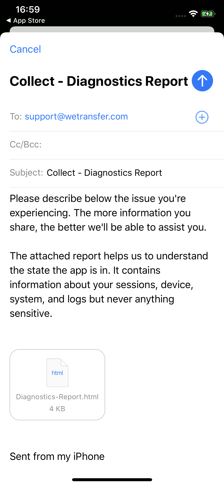
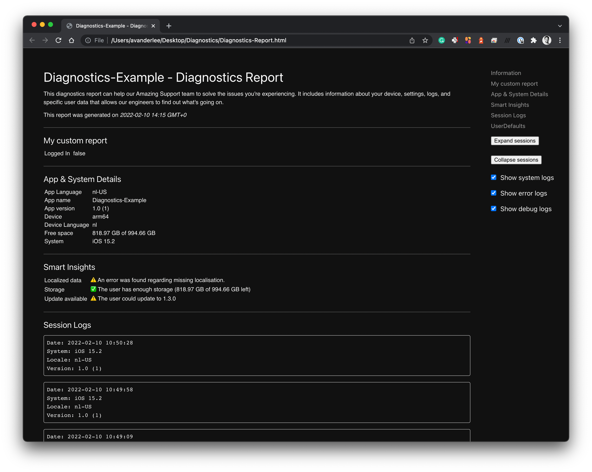

<p align="center">
    
</p>

<p align="center">


</p>

| Example mail composer | Example Report |
| --- | --- |
|  |  |

Diagnostics is a library written in Swift which makes it really easy to share Diagnostics Reports to your support team.

- [Features](#features)
- [Requirements](#requirements)
- [Usage](#usage)
    - [Adding your own custom logs](#adding-your-own-custom-logs)
    - [Adding your own custom report](#adding-your-own-custom-report)
- [Communication](#communication)
- [Installation](#installation)
- [Release Notes](#release-notes)
- [License](#license)

## Features

The library allows to easily attach the Diagnostics Report as an attachment to the `MFMailComposeViewController`.

- [x] Integrated with the `MFMailComposeViewController`
- [x] Default reporters include:
    - App metadata
    - System metadata
    - System logs devided per session
    - UserDefaults
- [x] A custom `DiagnosticsLogger` to add your own logs
- [x] Flexible setup to add your own custom diagnostics

## Usage

The default report already contains a lot of valuable information and could be enough to get you going. 

Make sure to set up the `DiagnosticsLogger` as early as possible to catch all the system logs, for example in the `didLaunchWithOptions`:

```swift
func application(_ application: UIApplication, didFinishLaunchingWithOptions launchOptions: [UIApplication.LaunchOptionsKey: Any]?) -> Bool {
    do {
        try DiagnosticsLogger.setup()
    } catch {
        print("Failed to setup the Diagnostics Logger")
    }
    return true
}
```

Then, simply show the `MFMailComposeViewController` using the following code:

```swift
import UIKit
import MessageUI
import Diagnostics

class ViewController: UIViewController {

    @IBAction func sendDiagnostics(_ sender: UIButton) {
        /// Create the report.
        let report = DiagnosticsReporter.create()

        guard MFMailComposeViewController.canSendMail() else {
            /// For debugging purposes you can save the report to desktop when testing on the simulator.
            /// This allows you to iterate fast on your report.
            report.saveToDesktop()
            return
        }

        let mail = MFMailComposeViewController()
        mail.mailComposeDelegate = self
        mail.setToRecipients(["support@yourcompany.com"])
        mail.setSubject("Diagnostics Report")
        mail.setMessageBody("An issue in the app is making me crazy, help!", isHTML: false)

        /// Add the Diagnostics Report as an attachment.
        mail.addDiagnosticReport(report)

        present(mail, animated: true)
    }

}

extension ViewController: MFMailComposeViewControllerDelegate {
    func mailComposeController(_ controller: MFMailComposeViewController, didFinishWith result: MFMailComposeResult, error: Error?) {
        controller.dismiss(animated: true)
    }
}
```

### Adding your own custom logs
To make your own logs appear in the logs diagnostics you need to make use of the `DiagnosticsLogger`. 

```swift
/// Support logging simple `String` messages.
DiagnosticsLogger.log(message: "Application started")

/// Support logging `Error` types.
DiagnosticsLogger.log(error: ExampleError.missingData)
```

The error logger will make use of the localized description if available which you can add by making your error conform to `LocalizedError`.

### Adding your own custom report
To add your own report you need to make use of the `DiagnosticsReporting` protocol.

```swift
/// An example Custom Reporter.
struct CustomReporter: DiagnosticsReporting {
    static func report() -> DiagnosticsChapter {
        let diagnostics: [String: String] = [
            "Logged In": Session.isLoggedIn.description
        ]

        return DiagnosticsChapter(title: "My custom report", diagnostics: diagnostics)
    }
}
```

You can then add this report to the creation method:

```swift
var reporters = DiagnosticsReporter.DefaultReporter.allReporters
reporters.insert(CustomReporter.self, at: 1)
let report = DiagnosticsReporter.create(using: reporters)
```

## Communication

- If you **found a bug**, open an issue.
- If you **have a feature request**, open an issue.
- If you **want to contribute**, submit a pull request.

## Installation

### CocoaPods

[CocoaPods](http://cocoapods.org) is a dependency manager for Cocoa projects. You can install it with the following command:

```bash
$ gem install cocoapods
```

To integrate Diagnostics into your Xcode project using CocoaPods, specify it in your `Podfile`:

```ruby
source 'https://github.com/CocoaPods/Specs.git'
platform :ios, '10.0'
use_frameworks!

target '<Your Target Name>' do
    pod 'Diagnostics', '~> 1.0.0'
end
```

Then, run the following command:

```bash
$ pod install
```

### Carthage

[Carthage](https://github.com/Carthage/Carthage) is a decentralized dependency manager that builds your dependencies and provides you with binary frameworks.

You can install Carthage with [Homebrew](http://brew.sh/) using the following command:

```bash
$ brew update
$ brew install carthage
```

To integrate Diagnostics into your Xcode project using Carthage, specify it in your `Cartfile`:

```ogdl
github "WeTransfer/Diagnostics" ~> 1.00
```

Run `carthage update` to build the framework and drag the built `Diagnostics.framework` into your Xcode project.

### Manually

If you prefer not to use any of the aforementioned dependency managers, you can integrate Diagnostics into your project manually.

#### Embedded Framework

- Open up Terminal, `cd` into your top-level project directory, and run the following command "if" your project is not initialized as a git repository:

  ```bash
  $ git init
  ```

- Add Diagnostics as a git [submodule](http://git-scm.com/docs/git-submodule) by running the following command:

  ```bash
  $ git submodule add https://github.com/WeTransfer/Diagnostics.git
  ```

- Open the new `Diagnostics` folder, and drag the `Diagnostics.xcodeproj` into the Project Navigator of your application's Xcode project.

    > It should appear nested underneath your application's blue project icon. Whether it is above or below all the other Xcode groups does not matter.

- Select the `Diagnostics.xcodeproj` in the Project Navigator and verify the deployment target matches that of your application target.
- Next, select your application project in the Project Navigator (blue project icon) to navigate to the target configuration window and select the application target under the "Targets" heading in the sidebar.
- In the tab bar at the top of that window, open the "General" panel.
- Click on the `+` button under the "Embedded Binaries" section.
- Select `Diagnostics.framework`.
- And that's it!

  > The `Diagnostics.framework` is automagically added as a target dependency, linked framework and embedded framework in a copy files build phase which is all you need to build on the simulator and a device.

---

## Release Notes

See [CHANGELOG.md](https://github.com/WeTransfer/Diagnostics/blob/master/Changelog.md) for a list of changes.

## Authors
This library is created as part of the [WeTransfer](https://www.wetransfer.com) Hackathon. Process has been reported on [Twitter](https://twitter.com/twannl/status/1201474263200550917?s=20). 

Thanks to:

- ["Offie"](https://twitter.com/offinga) for the HTML report
- [Casper](https://twitter.com/_casperlourens) for the awesome logo
- [Antoine](https://www.twiter.com/twannl) for the Swift Library

Also, a little shoutout to [1Password](https://www.1password.com) for [inspiring us](https://twitter.com/twannl/status/1200167786749874176?s=20) to create this library.

## License

Diagnostics is available under the MIT license. See the LICENSE file for more info.
